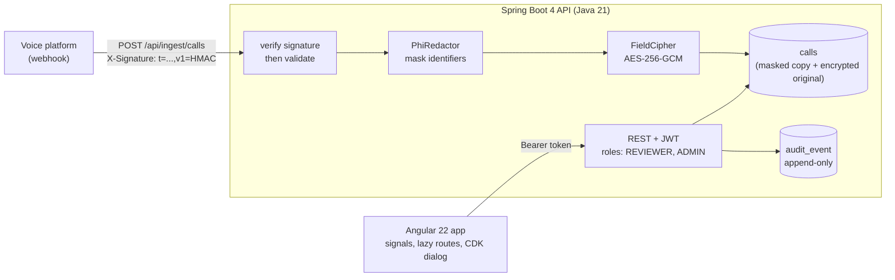

# clinic-call-console


*A reviewer sees masked calls and cannot reveal anything. An administrator must give a reason to reveal, and every sign-in, view and reveal lands in the audit trail. Full-quality clip: [`docs/demo.mp4`](docs/demo.mp4).*

A review console for the calls a **voice assistant** takes at a clinic front desk. The calls are the interesting part: they are full
of protected health information, and the people reviewing them should see as little of it as their job allows.

- **Masked by default.** Names, phone numbers, birth dates, emails, record and insurance numbers and addresses are masked when a call is
  received, and every screen shows only the masked copy.
- **Reveal on purpose.** Only an administrator can reveal a call, must give a reason, and the reveal and the reason are written to the audit
  trail in the same database transaction. The revealed text hides itself again after 60 seconds.
- **Everything is on the record.** Sign-ins (including failed ones), opened calls, status changes, reveals and incoming calls are listed in
  an admin-only audit trail.

> **This is a demonstration with synthetic data, not a HIPAA-compliant product.** No real patients, no business associate agreement, no
> certification. It shows HIPAA-minded engineering: least privilege, auditability, minimum necessary access, no PHI in logs.
> Limits are listed [below](#limits) and in [`docs/DECISIONS.md`](docs/DECISIONS.md).

**Live demo:** [clinic-call-console.vercel.app](https://clinic-call-console.vercel.app) (API: [clinic-call-console-api.onrender.com](https://clinic-call-console-api.onrender.com/actuator/health)). The API runs on free hosting that sleeps when idle, so the first visit can take a minute;
the login page says so while it waits.
Demo accounts (public on purpose, the data is invented): `reviewer@demo.test` / `reviewer-demo-pass` and `admin@demo.test` / `admin-demo-pass`.

## How it fits together



## What it demonstrates

| Area | In the project |
|---|---|
| **Angular 22** | Standalone components, signals (`computed`, `linkedSignal`), RxJS where streams matter (debounced search, health polling), `OnPush` and zoneless, typed reactive forms, lazy routes, a route **resolver**, functional **guards** and **interceptors**, `@defer`, CDK dialog with focus trap and focus return, runtime `config.json` |
| **Java / Spring Boot 4** | Spring Security 7 with JWT and `@PreAuthorize`, Spring Data JPA with Flyway migrations, validation, RFC 9457 error responses, a stable page contract, request-id logging with no bodies or PHI, actuator health |
| **Security** | AES-256-GCM on the sensitive columns, audit row in the same transaction as the action, HMAC-signed webhook with replay window and idempotency, login lockout, same message for unknown user and wrong password, `no-store` on PHI responses, a token that goes only to our own origin |
| **Accessibility** | Keyboard operable, labelled form fields, live regions for status changes, tags carry text and not only colour, 44 px touch targets, skip link, reduced-motion support |
| **Delivery** | Dockerfile (multi-stage, non-root), GitHub Actions CI, a keep-warm workflow, secrets only from the environment in the `prod` profile |

## How it is tested

| Layer | What | Count |
|---|---|---|
| Java unit and integration | redaction rules, encryption, webhook signature, lockout, and the whole API called with real tokens (wrong role, no token, forged token, expired token, missing reason, bad signature, replay) | 71 |
| Angular unit | guards, interceptors, services, every page, the reveal dialog, the route resolver | 126 |
| Browser end to end | a real Chromium walks login, filtering, masked reading, the reveal dialog, the audit trail and the phone layout at 390 px | 37 checks |
| **Mutation check** | `scripts/mutation_check.py` breaks one guard at a time (reveal no longer admin-only, audit not written, signature not checked, token sent to any origin, ...) and requires a genuine test failure each time | 28 of 28 caught |

The mutation check found two weak tests while this was being built (a cache-header assertion that Spring Security's default satisfied on its
own, and a mutant that did not change behaviour), and an end-to-end run found a form that submitted natively and reloaded the page. Each is now
pinned by a test.

```
cd api && ./mvnw test                      # 71 tests, no Docker needed
cd web && npx ng test --watch=false        # 126 tests (Vitest)
python scripts/mutation_check.py           # breaks 28 guards one at a time
node web/tests/e2e.cjs <shots-dir>         # needs the API on :8080 and the web app on :4200
```

## Run it

```
cd api && ./mvnw spring-boot:run           # http://localhost:8080 (H2 in memory, 36 synthetic calls seeded)
cd web && npm ci && npx ng serve           # http://localhost:4200
python scripts/send_webhook.py             # sends one correctly signed call, then a forged one and an unsigned one
```

The default profile uses demo secrets so it runs after a fresh clone. The `prod` profile (`SPRING_PROFILES_ACTIVE=prod`) has **no defaults** for
`JWT_SECRET`, `FIELD_KEY`, `WEBHOOK_SECRET`, `CORS_ORIGINS` and the demo passwords, so a missing variable stops the boot.

## Limits

- **Not production.** In-memory H2 in PostgreSQL mode, reseeded at start; passwords for two demo accounts; no SSO.
- **The redactor is rule-based.** It does not catch a name the caller never introduces, and it leaves appointment dates visible on purpose.
  A real system would use a certified de-identification service and the full Safe Harbor list.
- **The login lockout is in memory and per instance**; a multi-instance deployment needs Redis or a gateway.
- **The token is in `sessionStorage`**; a production build would use an httpOnly cookie from a backend-for-frontend (trade-off in `docs/DECISIONS.md`).
- **No real-time push.** The queue loads on demand.

## Layout

```
api/                       Spring Boot 4 (Java 21): calls, audit, auth, ingest, redaction, crypto, security, seed
  src/test/                71 tests; ApiSecurityTest and IngestApiTest call the real API as the wrong role
web/                       Angular 22: core (auth, interceptors, guards, services), shell, features (login, calls, audit), shared
  tests/e2e.cjs            Playwright walkthrough (37 checks)
scripts/                   mutation_check.py, send_webhook.py
demo/record.mjs            records the walkthrough that became docs/demo.gif
docs/DECISIONS.md          what was chosen, why, and what it costs
```
